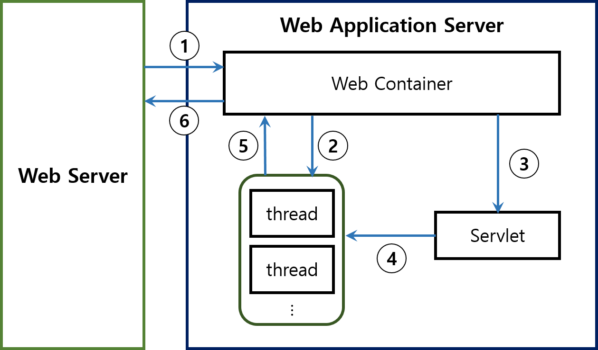

## Servlet/JSP에 대한 이해
#### 1. Web Server와 Web Application Server(WAS)의 차이
##### 1.1 Web Server
  - 정적인 페이지를 Client의 요청에 따른 페이지를 응답으로 보내주는 역할을 한다.
  - HTTP 프로토콜을 통해 전송된다.
  - Client의 요청 중 자체적으로 처리할 수 없는 정보에 대해서 WAS에 처리를 요청한다.
  - 과도한 요청을 받는 경우 Web Server에서는 웹문서를 처리하고 WAS에서는 JSP페이지를 처리하도록 함으로써 서버의 부담을 줄여주는 역할도 한다.
##### 1.2 WAS
  - Web Server의 기능에서 나아가 Client의 요청에 대해서 페이지 뿐만 아니라 `Web Container`가 내부적으로 프로그램을 수행해서 결과를 만들어내고 이를 페이지 혹은 데이터 형태로 응답해 주는 기능이 있다.
  - 일반적으로 Web Server의 기능을 내제하고 있기 때문에 자체적으로 서비스가 가능하다.
  - WAS 내부 구조
##### 1.3 WAS의 구조
  - WAS 내부 구조
  
    1. Web Server는 요청을 받고 Web Container에게 요청을 전달한다.
    2. Web Container는 Deplyment Descriptor(배포서술자, web.xml)를 참조해서 요청에 대한 Servlet의 thread를 생성하고 요청(HttpServletRequest)과 응답(HttpServletResponse) 객체를 생성해서 전달한다.
    3. Web Container에서 Servlet의 service() method를 호출한다.
    4. 호출된 Servlet에 대한 작업을 할 thread는 요청에 따라서 doPost() 혹은 doGet()을 호출해서 실행한다.
    5. doGet(), doPost() method에서 HttpServletResponse에 응답 내용을 Web Container에 전달한다.
    6. Web Container는 전달받은 응답을 HTTPResponse형태로 변환해서 Web Server에 전달한다. 이후 thread를 종료하고 요청(HttpServletRequest), 응답(HttpServletResponse)객체를 소멸시킨다.
  - Container
    - WAS에는 다양한 Container를 포함하고 있는데 Servlet관련 기능을 모아 놓은 것을 Servlet Container, Jsp관련 기능을 모아 놓은 것을 Jsp Container라고 한다.
    - Web Container라는 용어는 Servlet에 대한 내용을 언급할 때는 Servlet Container, Jsp에 대한 내용을 언급할 때는 Jsp Container를 생각하고 언급하는 것 같다.

##### 1.4 Web Server와 WAS의 차이
  - Web Server는 단순 html이나 이미지를 처리하는 부분이고 WAS는 DB와 연결해서 데이터를 주고 받는 동적인 처리를 하는 부분으로 목적이 다르다.

#### 2. jsp/Servlet
##### 2.1 Servlet 정의
- Servlet이란 WAS(Web Container)를 통해 컴파일 된 후 메모리에 적재되어 Client의 HTTP Get, Post 등의 요청을 처리하는 Java 프로그램이다.
- Servlet Container
  - Servlet의 주기관리
    - init(): Servlet이 Memory에 적재 될 때 실행
    - service(): Servlet이 Memory에 적재 된 후 요청에 대해서 실행될 때 Service method를 실행하고 요청에 따라 doGet, doPost를 실행
    - destroy(): WAS 종료 시 Servlet이 Memory에서 unload되기 전 수행되는 callback
  - 통신 지원
    - Web Server로 부터 받은 요청을 분석해 Servlet을 실행시키고 Servlet에서는 Web Server의 정보를 확인 할 수 있는 기능을 제공한다.
  - MultiThread 지원
    - Client의 요청에 따라 Servlet을 생성하고 이미 생성된 Servlet에 대한 요청은 Thread를 생성해서 실행한다.
- Thread를 생성해서 병렬적으로 service를 수행한다.
- Servlet 객체는 여러개 생성되지 않는다.

##### 2.2 Jsp 정의
- Java Server Pages의 약자로 Java 프로그램과 HTML 태그를 포함한 Server Side Application 개발 기술이다.
- Jsp 등장배경
  - 비지니스 로직과 프리젠테이션 로직을 분리할 목적으로 등장
  - 기존 Servlet에서 HTML구문 사용 방법의 어려움
    ```
    <Servlet에서 HTML 구문 사용법 예제>
    ...
    PrintWriter out = request.getWriter();
    out.println("<html>");
    out.println("<head>");
    ...
    ```
- Jsp 용도
  - Client에게 보여지는 페이지 역할
  - MVC 모델에서 View에 해당 (Presentation Layer)
- Jsp 변환과정
**(Jsp 변환 과정은 Jsp Container가 해주는 일이다.)**
  1. 변환 단계 (Translation Step)
      - jsp가 java파일로 변환된다.
      - helloJSP.jsp -> helloJSP_jsp.java
      - 해당 단계에서 비지니스 로직이 추가
  2. 컴파일 단계 (Compile Step)
      - 변환된 java파일을 컴파일
      - helloJSP_jsp.java -> helloJSP_jsp.class
  3. 실행 단계 (Interprete Step)
      - 생성된 class를 실행
      - 실행된 결과 값을 응답처리

- 재사용성과 유지보수에 수월함
  - 웹 디자이너는 자바언어를 배우지 않아도 웹 페이지를 수정할 수 있다.
  - 자바 개발자는 웹페이지의 디자인 작업 없이도 코드를 수정할 수 있다.
- Java Bean
  - Java Bean 규격서에 따라 작성된 Java Class를 의미한다.
  - JavaBeans are classes that encapsulate many objects into a single object (the bean)


#### 3. MVC model의 변화
##### 3.1 Model 1 방식
  - 사용자로부터 요청을 jsp가 받아서 처리
  - jsp 페이지에 비지니스 로직을 처리 하기 위한 코드와 웹 브라우저에 결과를 보여주기 위한 출력 관리 코드가 뒤섞여 있는 구조
  - 단점
    - jsp페이지 안에서 모든 정보를 표현(view)하고 저장(model)하고 처리(control)되므로 재사용이 힘들고 가독성이 떨어진다.
    - presentation login과 business login의 혼재
    - jsp 코드가 복잡해져서 유지 보수가 어렵다.
    - 웹 브라우저에서 code를 볼 수 있기 때문에 보안상 취약하다.
  - 장점
    - 진입장벽이 낮아서 배우기 쉽고 개발 속도가 빠르다.

##### 3.2 Model 2 방식
  - jsp, servlet 둘중 하나만 사용하는 것이 아니라 2개의 장단점을 모두 취해서 View는 jsp로 Controller는 Servlet으로 사용하는 구조
  - MVC model 1과 다르게 Client의 요청을 하나의 Servlet이 받게 된다.
  - Servlet은 웹 브라우저의 요청을 처리한 후 결과를 JSP 페이지로 forwarding한다.

##### 3.3 MVC Model 1과 Model 2의 차이
  - MVC Model 1
    - 사용자의 요청을 jsp가 받아서 다 처리하는 구조
  - MVC Model 2
    - 사용자의 요청을 Servlet이 받아서 Controller의 역할을 하는 구조

#### 4. jsp/Servlet 실행 흐름
##### 4.1 Servlet에 대한 요청일 경우 흐름
1. Web Server에 Client 요청(URL)
2. HTTP Request가 서버의 Servlet(Web) Container에 전송
3. Servlet Container에서 HttpServeltRequest와 HttpServletResponse 2가지 객체를 생성
4. 배포서술자(Deployment Descriptor)를 참조해서 요청 URL이 어떤 Servlet에 대한 요청인지 찾는다.
  - DD(배포서술자, Deployment Descriptor)
    - Web Container에게 사용자가 지금 접근한 URL 주소가 Servlet 요청임을 인식하고 그 Servlet Class의 위치는 어디에 있다고 알려주기 위해 필요한 정보들이 적혀 있는 팔이다.
    - Project의 `WebContent/WEB-INF/web.xml`파일에 작성
5. Servlet Container는 service() 메소드를 호출한다.
6. GET, POST 여부에 따라서 doGet() 혹은 doPost() method가 호출된다.
7. doGet() 또는 doPost() method는 동적인 페이지를 생성한 후 HttpServeltResponse 객체에 응답을 보낸다.
8. 응답이 완료되면 HttpServletRequest, HttpServletResponse 2가지 객체를 소멸시킨다.

##### 4.2 jsp에 대한 요청일 경우 흐름
1. Web Server에 Client 요청(URL)에서 .jsp 확장자로 요청이 jsp페이지인 것을 확인
2. jsp를 Web Container로 전송
    - Web Container는 jsp페이지 전체를 Servlet class Source code로 변환
    - Source code를 컴파일
    - 컴파일한 결과로 Servlet 객체를 생성
3. Servlet파일(.class) 객체를 생성해서 Memory(Heap영역)에 load
    - 결과적으로 실행되는 것은 Servlet이다.
    - jsp를 처음 실행하는 경우에 Source code로 변환, 컴파일 그리고 load등 작업이 이루어지는 시간 지연이 발생하지만 컴파일 후에는 메모리에 적재되어 사용되므로 이후 요청에 대해서는 시간 지연이 없다.
