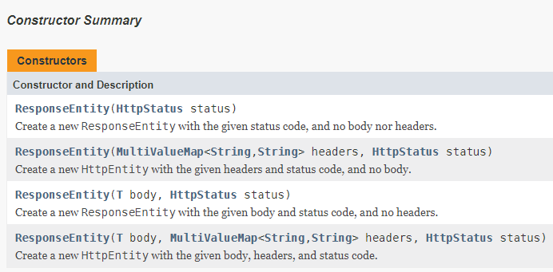

## 2017-07-23 학습일지

#### Front-End
###### - animate & stop
  > **.animate( properties [, duration ] [, easing ] [, complete ] )**

  - Perform a custom animation of a set of CSS properties.
  ```
  .animate({left:0},{
    duration : slow or fast or something value...,
    complete : function(){}
  });
  ```
  - animate함수는 위의 예제 코드처럼 처음 properties에는 변경될 css를 입력하고 duration, complete된 경우에 대해서 별도로 코드를 작성해서 동작시키거나 생략 가능하다.
  > **.stop( [clearQueue ] [, jumpToEnd ] )**

  - Stop the currently-running animation on the matched elements
  ```
  .stop(true, true).animate({left:0},{
    duration : slow or fast or something value...,
    complete : function(){}
  });
  ```
  - 위의 예제 코드와 같이 `animate 시키는 element object에 chaining` 해서도 사용한다. stop의 parameter로는 clearQueue와 jumpToEnd가 있는데, **clearQueue** 는 animate가 실행 될 때마다 queue에 실행들이 쌓이는데 이들을 모두 삭제 한다는 flag로 boolean 값을 받는다. **jumpToEnd** 는 현재 실행되고 있는 animation동작을 즉시 끝낼 것인지에 대한 설정을 하는 flag로 마찬가지로 boolean값을 받는다. (둘 다 default는 false이다.)
  - 예제 코드에서는 .stop(true, true)로 설정이 되어있기 때문에 animate가 다시 실행되기 전에 현재 동작중엔 animate를 즉시 끝내고 queue에 쌓인 animate동작들을 모두 비우라는 의미가 된다.
  - 예제 코드처럼 `.animate앞에 .stop을 chaining해서 사용하는 방법`은 이미지를 **flicking** 해서 넘기는 touch 동작을 구현하는데 유용하다. touch에 대한 event는 터치가 시작될 때 발생하는 `touchstart`, 터치를 화면에서 떼면서 발생하는 `touchend` 그리고 그 사이에 터치를 하고 움직일 때 마다 발생하는 event가 `touchmove`이다. 터치로 이미지를 넘겨보는 과정에서 분명 터치를 한 순간부터 이미지는 터치되고 있는 지점을 따라 다니는 것처럼 보이며 이를 animate로 처리 할 수 있다. touchmove가 발생하는 동안 터치 시작 점으로 부터의 거리를 계산해서 거리만큼 animate를 계속 시켜주면 이미지는 터치를 따라다니는 것 과 같이 보일 것이라 생각 되지만 사실 그렇지 않다.
  - 이유를 생각 해보면, `touchmove가 발생할 때 마다 animate를 호출`해서 이미지를 움직이면 이미지는 터치를 따라서 움직여야 하는데 **animate가 수행되는 속도가 터치가 움직이는 속도보다 빠르게 진행될 것이라는 보장이 없기 때문에 버퍼가 걸리는 듯한 움직임이 나타난다.** 이는 queue에 animate수행에 대한 동작들이 쌓여있다가 순차적으로 실행되기 때문이다. 따라서 스무스한 움직임을 구현하기 위해서는 animate를 하기 전에 stop 메서드로 현재 실행되는 animate를 즉시 실행해서 끝내고(jumpToEnd), 줄서서 기다리던 animate들을 모두 지워주고(clearQueue) 새로 animate를 실행 시켜야 한다.

----

###### Module을 Instance
  - Module을 만들어서 사용하는 방법 중에 `IIFE(Immediately Invoked Function Expressions)`으로 즉시실행 함수를 사용할 수 있다.
  - IIFE로 함수 선언 방법을 익히고 Module을 만들어서 사용을 하는데 Module은 C++/Java 의 class 처럼 직접 접근 할 수 없는 영역(private) 과 직접 접근 할 수 있는 영역(public)으로 나눌 수 있다. 직접 접근 할 수 있는 영역은 `return`으로 노출해줌으로써 접근을 할 수 있다.
  ```
  var testModule = (function(){
    var test;
    function setTest(param){
      test = param;
    }
    function logTest(){
      console.log(test);
    }

    return {
      setTest : setTest,
      logTest : logTest
    }
  })();

  var a = testModule.doTest(1);
  var b = testModule.doTest(2);
  //a와 b는 같은 testModule을 공유하기 때문에 결국 var test 값은 2
  ```
  - 위의 코드는 아주 간단한 IIFE를 사용한 Module을 작성한 예제이다. Module을 작성하면 변수나 함수명의 중복을 막는다는 이점도 있지만, 가장 중요한 점은 하나의 기능을 하는 덩어리? 즉 말 그대로 하나의 Module로 서의 기능을 할 필요가 있다. 하지만 내가 작성하는 방식으로 Module을 작성해서 사용하면 하나의 Module을 공유해서 사용하기 때문에 여러개를 instance해서 사용하고 싶은 경우에는 사용하기 어렵다. 이를 Component를 사용해서 해결 할 수 있지만, 아직 Module에 대해서도 완벽하게 이해를 못해서 좀 더 Module에 대해서 살펴보던 중 잘못된 Singleton Pattern의 instance방식에 대해서 보고 생각을 하게 되었다. [(singleton pattern)](https://addyosmani.com/resources/essentialjsdesignpatterns/book/#singletonpatternjavascript)
  ```
  var mySingleton = (function () {
     var instance;
     function init() {
        var privateRandomNumber = Math.random();
        function privateMethod(){
          console.log("I am private");
        }
        return {
          publicMethod: privateMethod
          publicProperty: "I am also public",
          getRandomNumber: function() {
            return privateRandomNumber;
          }
        };
    };

    return {
      getInstance: function () {
        if ( !instance ) {
          instance = init();
        }
        return instance;
      }
    };
})();

var myBadSingleton = (function () {
  var instance;
  function init() {
    var privateRandomNumber = Math.random();
    return {
      getRandomNumber: function() {
        return privateRandomNumber;
      }
    };
  };

  return {
    getInstance: function () {
      instance = init();
      return instance;
    }
  };
})();

var singleA = mySingleton.getInstance();
var singleB = mySingleton.getInstance();
console.log( singleA.getRandomNumber() === singleB.getRandomNumber() ); // true

var badSingleA = myBadSingleton.getInstance();
var badSingleB = myBadSingleton.getInstance();
console.log( badSingleA.getRandomNumber() !== badSingleB.getRandomNumber() ); // true

  ```
  - 참조한 페이지의 singleton pattern의 코드를 간략하게 가져왔는데 여기서 처음의 mySingleton Module의 경우 Singleton Pattern에 맞게 하나의 instance만을 생성해서 사용하고 있는 것을 볼 수 있다. 하지만, BadSingleton Module은 instance할 때 마다 각자 새로운 instance가 생성 되는 것을 확인 할 수 있다. 이를 보고 내부에 함수를 선언하고(init) 이 함수 객체 하나하나를 instance로 사용 할 수 있다는 것을 확인하게 되었다. 코드를 좀 더 살펴보면, getInstance를 하면 instance에 init() 함수 객체를 넣어서 이를 반환 해주는 것을 볼 수 있는데 이 부분이 핵심인 것 같다. IIFE 내부에 선언된 함수는 내부에서 실행할 때 마다 새로운 함수 객체를 만들어 내는 것인지, 아니면 자바스크립트에서 정의된 함수를 실행할 때 마다 새로운 함수 객체가 만들어 지는 것인지에 대한 이해가 아직 없기 때문에 '이렇게 하면 다른 함수 객체구나! 하지만 왜지?'에 대한 답을 할 수 없다. 이 부분은 좀 더 확인해볼 필요가 있다.

###### event emitter
----

#### Back-End
###### HttpEntity
  - HttpEntity는 RequestEntity와 ResponseEntity의 SuperClass(부모 클래스)로 Request 혹은 Response 둘 다 에서 사용 가능하며 Header와 body를 둘다 가지고 있는 형태이다.
  - RequestEntity는 Request에 대한 Header와 Body를 가지고 있는 형태이고 ResponseEntity는 Response에 대한 Header와 Body를 가지고 있는 형태이다.
> ###### ResponseEntity

  - `public class ResponseEntity<T> extends HttpEntity<T>`
  - Extension of HttpEntity that `adds a HttpStatus status code`. Used in RestTemplate as well @Controller methods.
  - ResponseEntity를 사용해서 Response의 Header정보와 Body에 대한 정보를 직접 넣어서 Client에게 전송 해 줄 수 있기 때문에 매우 유용하다. Status에 대한 정보를 좀 더 디테일 하게 처리 할 수 있는 방법을 제공해 준다고 생각이 된다.
  ```
  public ResponseEntity deleteCustomer(@PathVariable Long id) {

    if (null == customerDAO.delete(id)) {
      return new ResponseEntity("No Customer found for ID " + id, HttpStatus.NOT_FOUND);
    }

    return new ResponseEntity(id, HttpStatus.OK);

  }
  ```
  - 위의 예제코드에서는 Customer를 삭제하는데 삭제가 되지 않는 경우에는 body에 `"No Customer found for ID " + id` 를 넣어주고 Status는 NOT FOUNT (404)를 보내준다. 성공인 경우에 HTTP status는 OK(200)으로 응답 하도록 명시 해줄 수 있다.
  - 아래의 그림에서는 ResponseEntity의 4가지 생성자를 보여준다. 그림에서 볼 수 있듯이 ResponseEntity를 사용하는 경우 꼭 HttpSatus를 명시해 주어야 한다.
	

> ###### ResponseEntity와 ResponseBody의 차이점

  - 결과적으로 Response에 값을 설정 해줄 수 있는 기능은 결과적으로 같으나 구현상의 차이가 있다.
  - @ResponseBody를 사용하는 경우 파라미터로 Response객체를 받아와서 객체에서 값들을 설정해주고 ResponseEntity를 생성해서 반환하는 경우는 직접 클래스 객체를 생성하고 값을 설정하고 반환하는 차이가 있다.
----

- NamedParameterJdbcTemplate
	- update
		- public int update(String sql, Map<String,?> paramMap)
throws DataAccessException
		- Description copied from interface: NamedParameterJdbcOperations
			- Issue an update via a prepared statement, binding the given arguments.
		- Specified by:
			- update in interface NamedParameterJdbcOperations
		- Parameters:
			- sql - SQL containing named parameters
			- paramMap - map of parameters to bind to the query (leaving it to the PreparedStatement to guess the corresponding SQL type)
		- Returns:
			- the number of rows affected
		- Throws:
			- DataAccessException - if there is any problem issuing the update
	- update 실행으로 반환되는 결과는 update혹은 delete가 영향을 미친 row의 수를 return해준 다는 것을 spring 문서를 보고 확인하게 되었다.
  - queryForObject() throws EmptyResultDataAccessException when record not found
  	- https://www.mkyong.com/spring/queryforobject-throws-emptyresultdataaccessexception-when-record-not-found/
----
###### ETC
- 외부 properties에 저장한 값을 pom.xml뿐만 아니라 java 파일에도 @Value 어노테이션을 이용해서 값을 가져올 수 있다.
