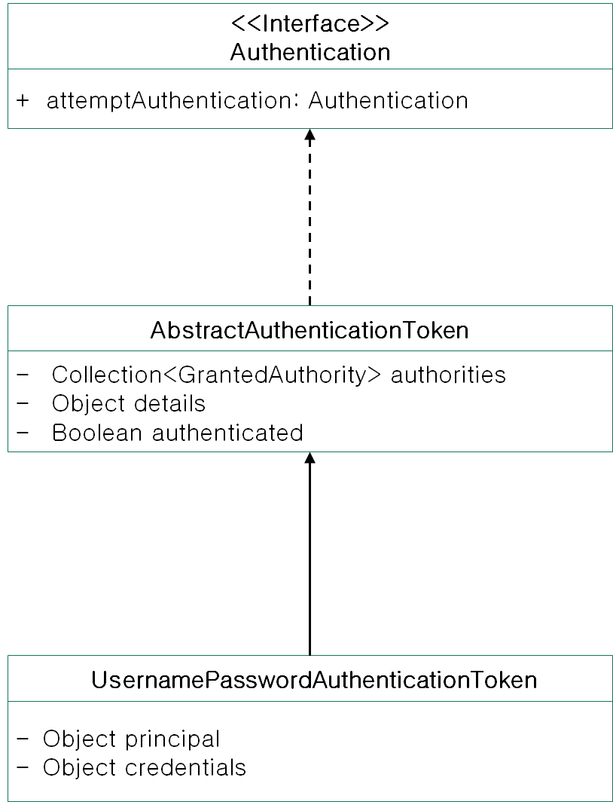

## Spring Security 기본 인증

### 보안관련 3요소
1. Principal (접근 주체)
- 보호된 대상에 접근하는 사용자
2. Authenticate (인증)
- 현재 사용자가 누구인지 확인/인증 하는 과정
- 기본적인 아이디/패스워드(로그인)을 이용한 인증 처리
3. Authorize (인가)
- 인증된 사용자가 특정 Resource(기능, URL)에 대한 접근 권한이 있는지 검사

### Spring Security 에서 보안관련 3요소 Mapping

1. Principal -> Authentication
2. Authenticate -> AuthenticationManager
3. Authorize -> SecurityInterceptor


### Authentication 의 용도
- **현재 접근주체의 정보**를 담는 목적
- 인증 요청 시, 요청 정보를 담는 목적

### SecurityContext
- Authentication을 저장
- Spring security에서 현재 사용자의 Authentication 정보를 가져올 때 SecurityContext 로 부터 가져온다

- SecurityContext는 SecurityContextHolder를 통해서 저장이 된다.
> `SecurityContextHolder.getContext().setAuthentication(Authentication)`
> SecurityContext에 저장된 Authentication 정보는 사용자의 인증정보이기 때문에 scope가 세션가 되어야 하며 기본적으로 SecurityContext는 ThreadLocal에 저장한다.

### AuthenticationManager
- 기본 로그인 **인증처리**는 **AuthenticationManager**에 의해서 처리된다.
```java
public interface AuthenticationManager {
	Authentication authenticate(Authentication authentication)
			throws AuthenticationException;
}
```

> parameter로 **authentication request**를 받고 authentication 처리를 한 후에 성공 시 Authentication 객체를 반환한다.

> 인증에 실패하는 경우 AuthenticationException을 발생한다.

### Authentication Request
- **UsernamePasswordAuthenticationProcessingFilter** Class의 `attemtAuthentication` 는 Authentication 객체를 가져오기 위한 method이다.
- 해당 method에서는 Authentication Request를 만들고 이를 AuthenticationManager가 사용해서 Authentication객체를 만든다.
```java
UsernamePasswordAuthenticationToken authRequest = new UsernamePasswordAuthenticationToken(username, password);
this.setDetails(request, authRequest);
return this.getAuthenticationManager().authenticate(authRequest);
```
- username과 password는 request로 부터 가져오며, 해당 정보를 이용해서 UsernamePasswordAuthenticationToken을 생성한다. 해당 Token에서 username -> principal, password -> credentials 값으로 저장한다. 이후 authentication에 대한 요청이기 때문에 authenticated값은 false로 설정한다.
- authRequest에 현재 request정보를 저장한 후에 AuthenticationManager의 authenticate method로 Authentication객체를 얻어온다.
- AuthenticationManager는 Interface이기 때문에 구현체인 ProviderManager의 Authentication이 실행된다.


- Authentication Class Hierarchy
hi



### 기본 인증 처리 과정
`UsernamePasswordAuthenticationProcessingFilter` 는 `AbstractAuthenticationProcessingFilter` Class를 확장하는 Class이며, doFilter method 가 실행되면서 authentication정보를 가져오기 위해서 **attemptAuthentication** method를 호출한다. `AbstractAuthenticationProcessingFilter`의 attemptAuthentication method는 Abstract method이기 때문에 `UsernamePasswordAuthenticationProcessingFilter` 에서 구현체를 작성해 주어야 한다.
```java
public void doFilter(ServletRequest req, ServletResponse res, FilterChain chain) throws IOException, ServletException {
    HttpServletRequest request = (HttpServletRequest)req;
    HttpServletResponse response = (HttpServletResponse)res;
    if (!this.requiresAuthentication(request, response)) {
        chain.doFilter(request, response);
    } else {
        if (this.logger.isDebugEnabled()) {
            this.logger.debug("Request is to process authentication");
        }

        Authentication authResult;
        try {
            authResult = this.attemptAuthentication(request, response);
            if (authResult == null) {
                return;
            }

            this.sessionStrategy.onAuthentication(authResult, request, response);
        } catch (InternalAuthenticationServiceException var8) {
            this.logger.error("An internal error occurred while trying to authenticate the user.", var8);
            this.unsuccessfulAuthentication(request, response, var8);
            return;
        } catch (AuthenticationException var9) {
            this.unsuccessfulAuthentication(request, response, var9);
            return;
        }

        if (this.continueChainBeforeSuccessfulAuthentication) {
            chain.doFilter(request, response);
        }

        this.successfulAuthentication(request, response, chain, authResult);
    }
}
```

- 인증이 완료된 후 successfulAuthentication method가 호출되며 해당 부분에서는 Authentication정보를 SecurityContext에 저장하고 SuccessHandler의 onAuthenticationSuccess함수를 호출한다.

```java
protected void successfulAuthentication(HttpServletRequest request, HttpServletResponse response, FilterChain chain, Authentication authResult) throws IOException, ServletException {
    if (this.logger.isDebugEnabled()) {
        this.logger.debug("Authentication success. Updating SecurityContextHolder to contain: " + authResult);
    }

    SecurityContextHolder.getContext().setAuthentication(authResult);
    this.rememberMeServices.loginSuccess(request, response, authResult);
    if (this.eventPublisher != null) {
        this.eventPublisher.publishEvent(new InteractiveAuthenticationSuccessEvent(authResult, this.getClass()));
    }

    this.successHandler.onAuthenticationSuccess(request, response, authResult);
}
```

### 참고 URL
- https://www.slideshare.net/madvirus/ss-36809454
- http://preludeb.egloos.com/v/4738521